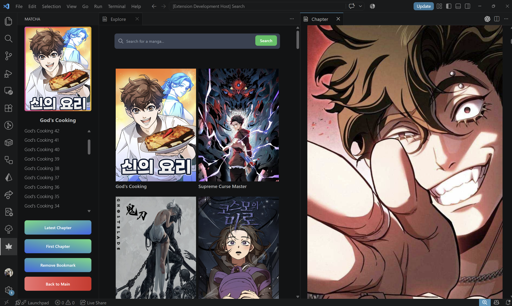

<h2 align="center" style="border-bottom: none">
    

    

    Matcha
</h2>

Read your favorite mangas through VSCode

 

 

### Happy Update!

After almost 4 years, I finally found the courage to revamp and maintain this project again. You can install Matcha again! Stay tuned for incoming cool updates!

### Usage

This extension features a number of features:

- Read manga directly while coding
- Watch anime directly while coding (no audio yet, but subtitles)
- Get manga and anime news
- Save your mangas to your list

### Preview

<video src="./media/anime-showcase.mp4"></video>

## Third-Party Services

This extension is not affiliated with or endorsed by any third-party service it uses.

If you operate a supported service and would like your integration removed, please contact
hello@arthantyo.com.
